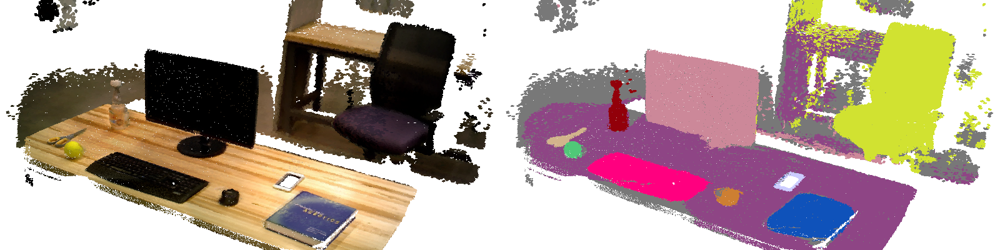
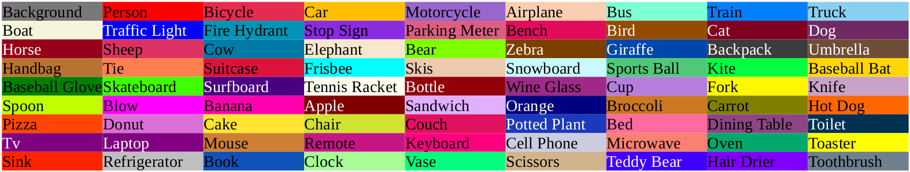
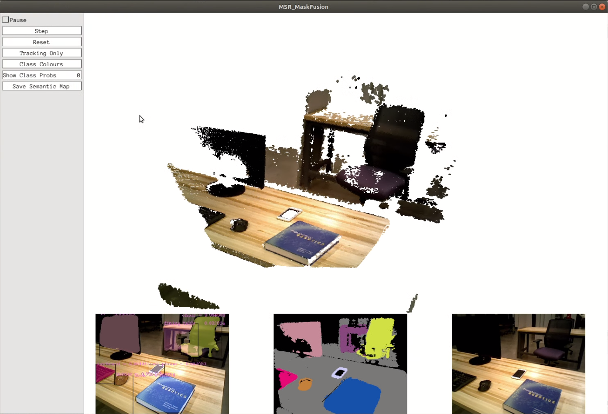

# MaskFusion_cpp
A real-time dense RGB-D SLAM system that can recognizes, segments and assigns semantic class labels (80 different classes) on 3D surfel map.


     

     
**[Click here to see the demo video!](https://youtu.be/9d0Szh7lkns)**
     
**[Click here to see the project report!](https://msr-peng.github.io/portfolio/projects/maskfusion_cpp/)**
     
# Reference
* [Kolkir C++ implementation of mask-rcnn](https://github.com/Kolkir/mlcpp/tree/master/mask_rcnn_pytorch).
* **[Mask R-CNN](https://research.fb.com/wp-content/uploads/2017/08/maskrcnn.pdf)**, *Kaiming He, Georgia Gkioxari, Piotr Dollar, and Ross Girshick*, ICCV '17
* **[SemanticFusion: Dense 3D Semantic Mapping with Convolutional Neural Networks](http://wp.doc.ic.ac.uk/bjm113/wp-content/uploads/sites/113/2017/07/SemanticFusion_ICRA17_CameraReady.pdf)**, *J. McCormac, A. Handa, A. J. Davison, and S. Leutenegger*, ICRA '17
* **[ElasticFusion: Real-Time Dense SLAM and Light Source Estimation](http://www.thomaswhelan.ie/Whelan16ijrr.pdf)**, *T. Whelan, R. F. Salas-Moreno, B. Glocker, A. J. Davison and S. Leutenegger*, IJRR '16
     
# Hardware
In order to run MaskFusion_cpp pipeline smoothly, you need 2 GPU with enough memory to store multiple models simultaneously. I used two Nvidia GTX 1080i for experiments.
     
# How to build it?
I recommend to build MaskFusion_cpp environment by [nvidia-docker](https://github.com/NVIDIA/nvidia-docker). You can build the MaskFusion_cpp docker image by the Dockerfile I provided:
```
cd MaskFusion_cpp/docker
docker build -t maskfusion_cpp .
```
I also provided script `build.sh` shows step-by-step how MaskFusion_cpp is built based on Ubuntu 16.04 environment (within CUDA 9.0, cuDNN 7.1.4 and OpenGL 4.6.0) and which dependencies are required.
     
# Download MaskRCNN Models
You can download the pre-trained MaskRCNN model from [here](https://drive.google.com/file/d/1H8_0uxCt7J7QIqQWs2QL-fW558-jRm9a/view). Then put the downloaded model `mask_rcnn_coco.dat` in `MaskFusion_cpp/model` directory.
     
# Run MaskFusion_cpp

     
If you have a ASUS Xtion Pro Live depth camera working, then you can run MaskFusion_cpp after build it.
```
cd MaskFusion_cpp && mkdir build && cd build && cmake .. && make -j`nproc`
./MaskFusion_cpp
```
If you want to run MaskFusion_cpp offline, firstly you need use [Logger2](https://github.com/mp3guy/Logger2) to record a RGB-D stream and save it as klg file, then run
```
./MaskFusion_cpp -l path_to_your_klg_file
```
If you build MaskFusion_cpp in docker environment as I suggest, before you run it, you should make sure the docker container can run GUI applications. In your host's terminal, run
```
xhost +
```
This will adjust the permissions of the X server host, make docker container can display something on your screen.
     
Then start your docker container by run
```
docker run --privileged --runtime=nvidia -it /tmp/.X11-unix:/tmp/.X11-unix -e DISPLAY=unix$DISPLAY -e GDK_SCALE -e GDK_DPI_SCALE your_maskfusion_cpp_docker_image_name /bin/bash
```
You can save the semantic surfel map in MaskFusion_cpp pipeline, the map will be saved as ply files in `/home/src/MaskFusion_cpp/map/` directory.
     
# Tools
* Recorder for klg files: https://github.com/mp3guy/Logger2
* Viewer for ply files: https://github.com/cnr-isti-vclab/meshlab
